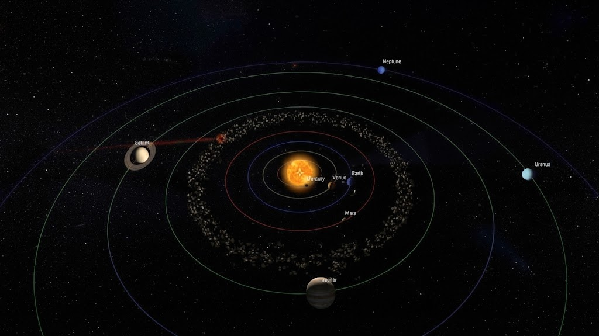

# 🚀 Solar System Exploration 3D

An interactive **3D Solar System Exploration** project built with **C++ and OpenGL** as part of a Computer Graphics project.

The application combines real-time planetary motion, interactive planet exploration, procedural terrain generation, dynamic lighting, textures, multiple camera modes, meteor effects, asteroid impacts, and cinematic exploration.

## 🌌 Project Overview

**Solar System Exploration 3D** allows users to explore the Solar System through different planetary environments and interactive rendering modes.

The project includes real-time planetary motion, multiple exploration modes, procedural planetary terrain, dynamic visual effects, camera systems, scene transitions, and an interactive HUD.

## ✨ Features

### 🪐 Solar System Simulation

- Real-time 3D Solar System environment
- Planetary orbits
- Planet self-rotation
- Multiple celestial bodies
- Dynamic planetary visualization
- Planet textures and lighting

### 🚀 Planet Exploration

| Key | Exploration Mode |
|---|---|
| `1` | Mercury Surface |
| `2` | Venus Terrain |
| `3` | Earth Terrain |
| `4` | Mars Terrain |
| `5` | Jupiter Storm |
| `6` | Saturn Ring / Sky |
| `7` | Uranus Haze |
| `8` | Neptune Interior |

### 🌍 Procedural Terrain

The project includes procedural environments for multiple planets.

- Procedural terrain generation
- Noise-based terrain variation
- Terrain chunk generation
- Level of Detail (LOD)
- Terrain streaming
- Planet-specific environments
- Earth terrain, water, clouds, weather, and detail objects
- Venus highlands, volcanic regions, plains, lava, plateaus, and terrain details
- Mars terrain and particle effects
- Neptune terrain and snow effects

### ☄️ Space Effects

- Asteroid belt
- Meteor shower
- Impact asteroid
- Asteroid impact effects
- Explosion effects
- Particle effects
- Dynamic star field

### 🎥 Camera System

- Free Camera
- Focus Camera
- Inspect Camera
- Explore Camera
- Planet View Camera
- Terrain Camera
- Planet-specific camera states
- Mouse-look interaction
- Camera transitions
- Cinematic camera tour

### 💡 Graphics & Rendering

The project demonstrates:

- 3D transformations
- Dynamic lighting
- Texture mapping
- OpenGL rendering
- Skybox rendering
- Planet rendering
- HUD and 2D overlays
- Scene transitions
- Particle and visual effects

## 🎮 Controls

| Control | Action |
|---|---|
| `ENTER / SPACE` | Start Exploration |
| `C` | Cinematic Tour |
| `F1 / ?` | Open Controls Panel |
| `1 - 8` | Switch Planet Exploration Mode |
| `W A S D` | Move Camera |
| `Mouse` | Look Around |
| `ESC` | Back / Exit |
| `F` | Toggle Fullscreen |
| `T` | Trigger Meteor Shower |
| `I` | Trigger Impact Asteroid |

## 🖥️ Scenes

The renderer supports several major environments:

- 🌌 Space Scene
- 🌍 Earth Scene
- 🟠 Venus Scene
- 🔴 Mars Scene
- 🔵 Neptune Scene

The rendering system manages scene transitions, planetary environments, HUD elements, cinematic tours, and interactive effects.

## 🏗️ Project Structure

```text
Solar-System-OpenGL/
│
├── SolarSystem_main.cpp
├── $olar$ystem_impl.cpp
├── $olar$ystem.cpp
│
├── Camera.cpp
├── Camera.h
│
├── Renderer.cpp
├── Renderer.h
│
├── TextureManager.cpp
├── TextureManager.h
│
├── Utils.cpp
├── Utils.h
│
├── Earth.cpp
├── Earth.h
│
├── Mars.cpp
├── Mars.h
│
├── Venus.cpp
├── Venus.h
│
├── Neptune.cpp
├── Neptune.h
│
├── stb_image.h
│
└── Assets / Textures
```

## 🧩 Main Components

### Camera

Handles camera movement, camera modes, planet focus, exploration, terrain views, cinematic movement, and mouse interaction.

### Renderer

Handles scene rendering, planets, the Sun, asteroid belt, meteor shower, impact asteroid, HUD, scene transitions, and cinematic tours.

### TextureManager

Manages planetary textures, Sun textures, skybox textures, Earth textures, cloud textures, Mars procedural textures, asteroid textures, and visual effect textures.

### Earth

Provides the Earth exploration environment with procedural terrain, terrain chunks, LOD, weather, water, clouds, and environmental details.

### Venus

Provides a procedural Venus environment with FBM-based terrain, highlands, volcanic regions, plains, lava formations, plateaus, terrain details, chunk generation, LOD, and terrain streaming.

### Mars

Provides procedural Mars terrain, particle effects, HUD elements, and Mars-specific camera behavior.

### Neptune

Provides procedural Neptune terrain, snow/environmental effects, terrain chunks, LOD, and planet-specific rendering.

### Utils

Contains shared planet data, asteroid and meteor data, detail objects, mathematical utilities, noise functions, simulation state, scene state, UI state, and window/FPS state.

## 🛠️ Technologies

- **C++**
- **OpenGL**
- **FreeGLUT**
- **stb_image**
- Procedural Generation
- 3D Computer Graphics

## 💻 Requirements

- Windows
- Visual Studio
- C++ compiler
- OpenGL
- FreeGLUT
- `stb_image.h`

## 🚀 Getting Started

### 1. Clone the Repository

```bash
git clone https://github.com/YOUR_USERNAME/YOUR_REPOSITORY.git
```

### 2. Open the Project

Open the Visual Studio solution/project and make sure the required OpenGL and FreeGLUT dependencies are configured.

### 3. Verify Assets

Make sure the required planetary textures, skybox textures, and other visual assets are located in the expected project directories.

### 4. Build

Select the appropriate Visual Studio configuration, for example:

```text
x64
Debug
```

Then build the project.

### 5. Run

Launch the application and press:

```text
ENTER
```

or:

```text
SPACE
```

to start the exploration.

## 🎥 Project Demo

[](https://youtu.be/yEXbUar2L8o)

**▶️ Watch the full project demonstration on YouTube**

## 📚 Learning Outcomes

Through this project, the development process covered:

- OpenGL graphics programming
- C++ graphics development
- 3D transformations
- Lighting systems
- Texture mapping
- Camera systems
- Procedural terrain generation
- Level of Detail techniques
- Scene management
- Particle effects
- Real-time rendering
- Debugging
- Code organization

## 📄 License

This project was developed as an educational Computer Graphics project.

Please refer to the repository license for usage and redistribution terms.

---

### 🌌 Solar System Exploration 3D

**C++ • OpenGL • FreeGLUT • Computer Graphics • 3D Rendering**

> Explore the Solar System. Discover new worlds. Experience 3D space exploration. 🚀
